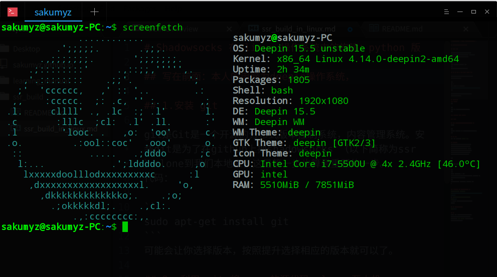
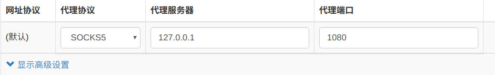

# Shadowsocks 在 linux 操作系统中的构建：python 版

## 写在前面：本人的电脑为 deepin15.5 操作系统，基于debian ， 其他的发行版本，按照自行的安装命令灵活修改便可。


## 1.安装 git

git是Git是一个开源的分布式版本控制系统，内容管理系统。安装git是为了在github上把shadowsocks （以下简称为ssr）clone到我们本地来，这是第一步也算最重要的一步。
代码：

```
sudo apt-get install git
```
可能会让你选择版本，按照提升选择相应的版本就可以了。

## 2. 利用 git 将 ssr 的源代码 clone 至本机

在clone之前，先想好将文件clone至哪个文件夹，这里就克隆至我自己的username文件夹下。

```
cd ~
git clone -b manyuser https://github.com/Ssrbackup/shadowsocksr.git
```

命令执行完毕后会在当前目录(/home/username)新建一个shadowsocksr目录。

## 3.配置文件修改
### 打开配置文件
代码：

```
sudo vi /etc/shadowsocks.json
```

### 将自己代理商的 json 文件替换上去

### 保存退出

## 切换至 /shadowsocksr/shadowsocks/ 目录
然后运行：

```
python local.py -c /etc/shadowsocks.json
```

## 关闭 ssr
在刚刚 ssr 开启成功的页面按 `Ctrl + C`

## 重命名启动命令
现在，ssr已经可以正常启动了，然而每次开机需要敲如此长的命令实在是麻烦，所以索性直接把命令重命名。我们当然是可以使用各种脚本来完成这项任务，但是没那个必要。我们只需要用到 alias 这个命令，字面意思，就是别名。但是外码单独的使用alias有一个问题就是我们一旦关机，别名就不再生效，所以要用一个长期有效的方式使其有效，所以外码可以把别名加入bashrc文件里。

运行：

```
sudo vi ~/.bashrc
```

添加：
```
alias ssr_start = 'cd ~/shadowsocksr/shadowsocks;python local.py -c /etc/shadowsocks.json'
```
保存退出，现在你就可以使用 ssr_start 这个命令来启动 ssr 了


## 在 chrome 安装 SwitchyOmega 插件
[SwitchyOmega github传送门](https://github.com/FelisCatus/SwitchyOmega/releases)
下载 `SwitchyOmega_Chromium.crx`

在 chrome 里将插件加进去，打开更多工具，拓展程序，加载已解压的拓展程序

## 配置 SwitchyOmega


## 结语
第一次配置 ssr 时配置了将近三天才成功，虽然网上的教程很多，我按着一个又一个的教程试，都是输入启动命令的时候报错，他们的启动命令在最后都加了 `-d start` 我也是无意间去掉了这个参数，结果一次成功。成功了真的很开心。
